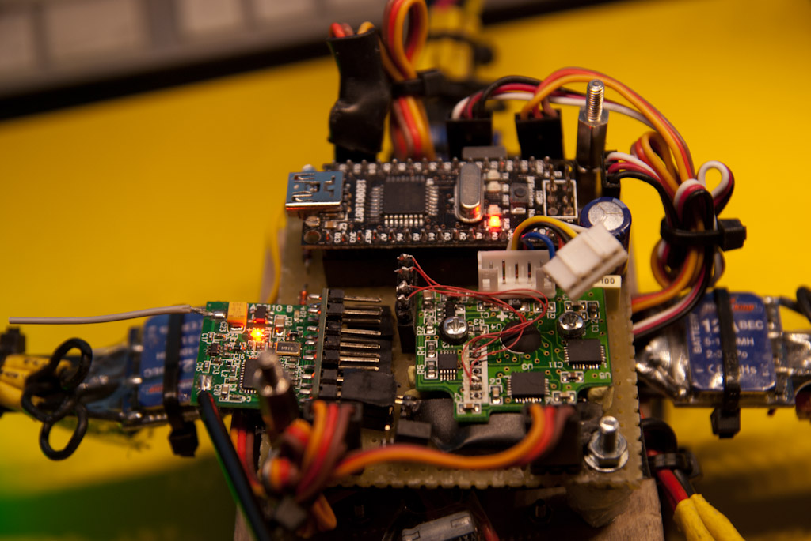
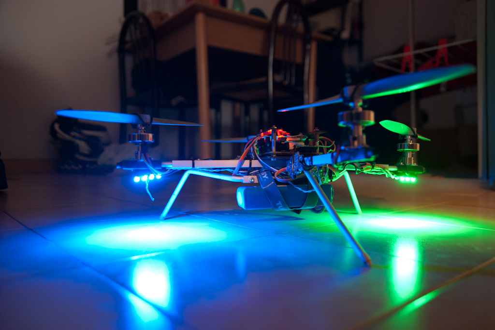

In this post i'll show the new version of the quadricopter I'm building.

It's based on the excellent [MultiWiiCopter (previously TriWiiCopter)](http://www.rcgroups.com/forums/showthread.php?t=1261382)

The copter is based on

- 4x <a title="HXM2730-1300 24gm brushless" href="http://www.hobbyking.com/hobbyking/store/uh_viewItem.asp?idProduct=2069" target="_blank">HXM2730-1300 24gm brushless</a> outrunners from hobbyking;
- 4x <a title="Hobbyking Blueseries 12A ESCs" href="http://www.hobbyking.com/hobbyking/store/uh_viewItem.asp?idProduct=11429" target="_blank">Hobbyking blueseries 12A ESC</a> (please, do yourself a big favor: BUY THE PROGRAMMING CARD, unfortunately in my case it was in backorder so I became crazy with strange and unfinishing beep sequences);
- 2200mAh 3S 20C lipo (lesson learned: it is a lot better to use a lighter lipo, it weights slightly more than 180gm);
- Arduino nano clone (dfrduino);
- [Spektrum AR6200 clone](http://www.hobbyking.com/hobbyking/store/uh_viewItem.asp?idProduct=12586) 6ch receiver;
- WiiMotion+ clone (one with IDG gyro, performance wise very close to the original one);
- self made breadboarded pcb to contain all the electronic stuff;

Actual frame is built with 4 12x2mm Carbon fiber arms, joint in the middle with a 70x70x4mm birch wood multistrate plate.

it has a dry weight (without battery) of around 350gm with props installed.

Previously the frame was a cross made from 8x8mm Alu U profile. No need to say that after a long list of crashes (this was the first flying thing I flew) at the end it gived up.

Some picture of the new and one of the old one:

