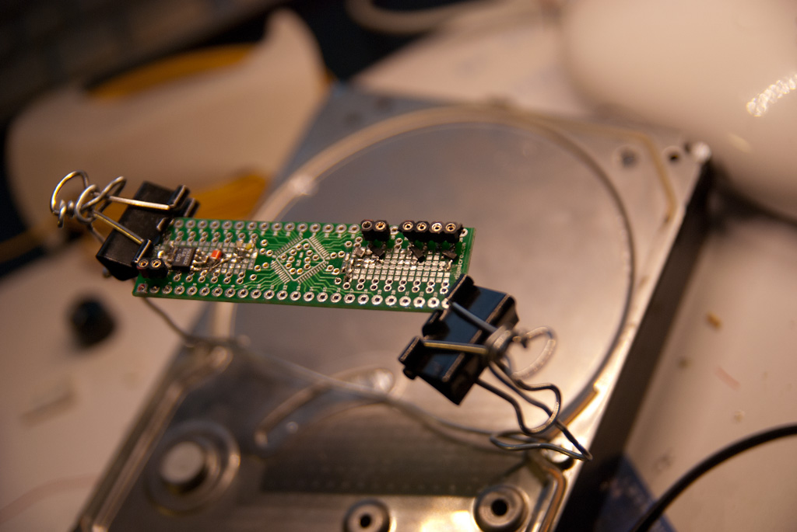
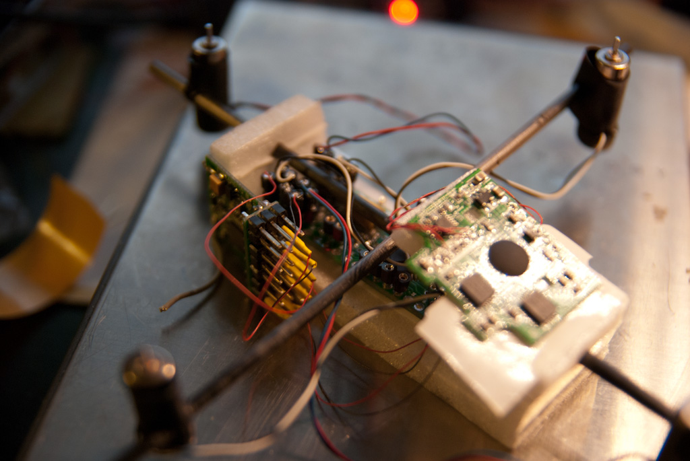

Yesterday i finished the controller board prototype for the new NanoQuad i'm building.

the board measures 60x18mm (it is a lqfp48 proto board i bought from dipmicro.com)

It contains:

- AVR ATMega328
- a max682 to raise the single lipo (4V to 3V) supply to 5V;
- 4 SI2304 N Mosfet used to power the brushed motors;

In this first phase i'll control it using a DSM2 compatible Six channel radio from HobbyKing.

The gyro is simply a WiiMotion+ board.

Future versions of the quad will implements:

- Bluetooth connection and remote control instead of the DMS2 Radio;
- Smaller ITG3200 Gyro board;

The bluetooth radio will connect wirelessy the nanoquad to a controller board that contains an lcd, an atmega8, a bluetooth module and a port for an wii classic controller to be used to drive the quad.

The lcd will make able to change parameters and for a simple &#8220;telemetry&#8221;.

Here are some pictures (unfortunately i missed the finished controller board alone).

`youtube: [First NanoQuad integration test](http://www.youtube.com/watch?v=7yxQ0K3MH50)`

Update 24 March 2011: here is the [MultiWii](http://wbb.multiwii.com/index.php) (thanks To Alexinparis ) software modified to drive directly four mosfet to power brushed motors (be aware, the software was only used to test the setup, never flyed,  so use at you own risk.)

[MicroboMultiWii1_6](https://alessiomorale.com/wordpress/wp-content/uploads/2011/02/MicroboMultiWii1_6.zip)
