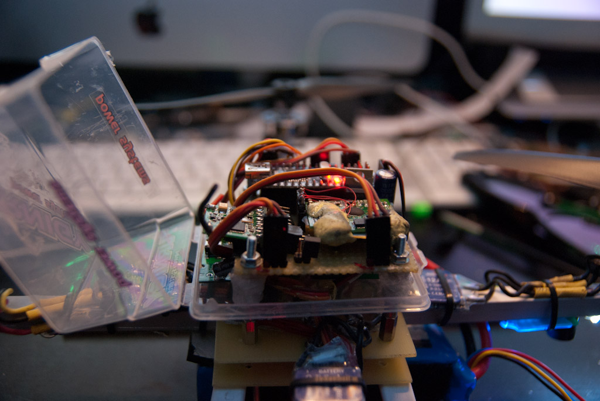
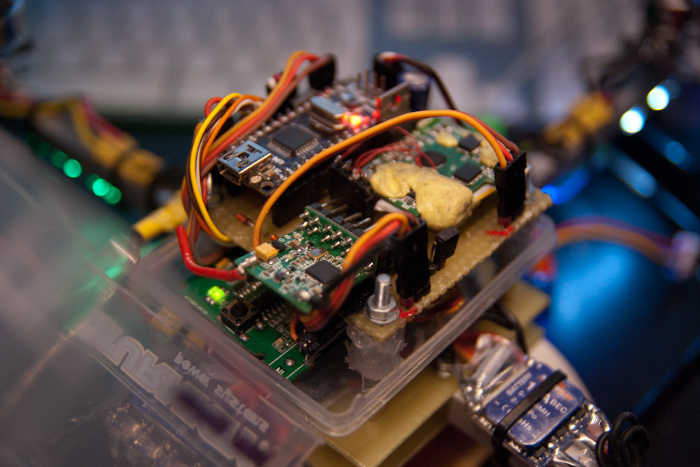
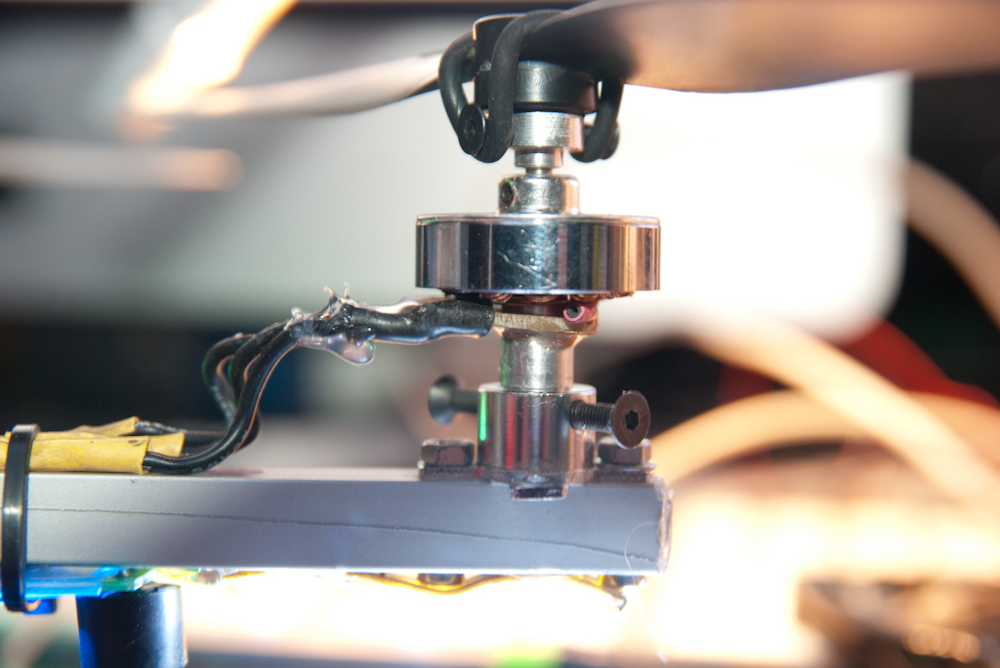
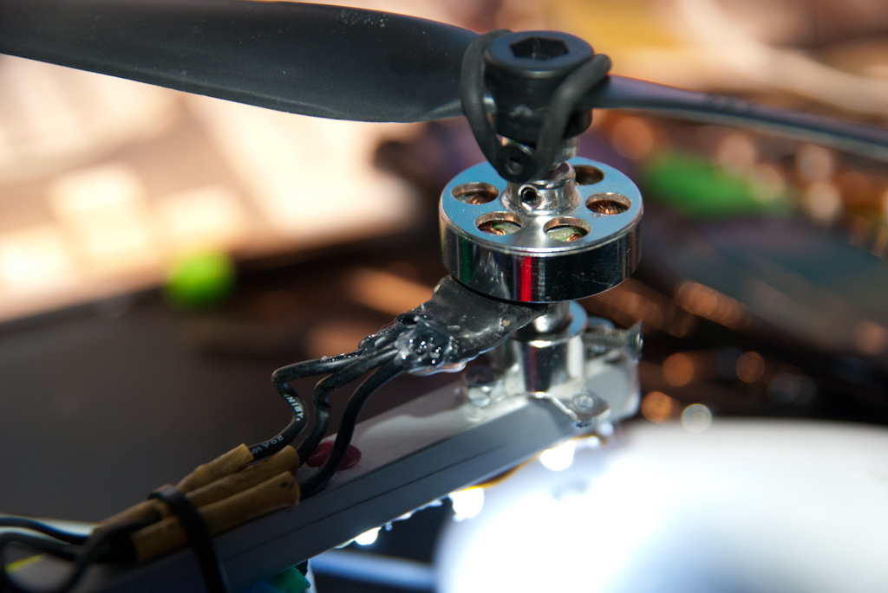

After a few crashes with the carbon fiber arms version, i rebuild the quad from scratch using the following components for the frame:

- 2x 1.5mm Glass fiber 70x70 center plates
- Alu arms, 160mm lenght 10x10mm
- T-Rex (don't rememeber which one) langing gear with 5mm glass fiber extra lenght skids (the original skids died shortly after being installed:) )
- Little plastic squared box on top containing cpu board, sensors and receiver. The electronic is dampened using four self made silicone rubber dampeners

The arms are tied together between the two center plates using m3 bolt and screws.

As you can see from the pictures, one of the motor was slightly modded: one of the wires was broken, so i rewound the motor and soldered the tiny wires to a tiny pcb board glued using epoxy to the mounting shaft. The connection are then made from this little pcb board so that there is no possibilities to break again the motor wires.

