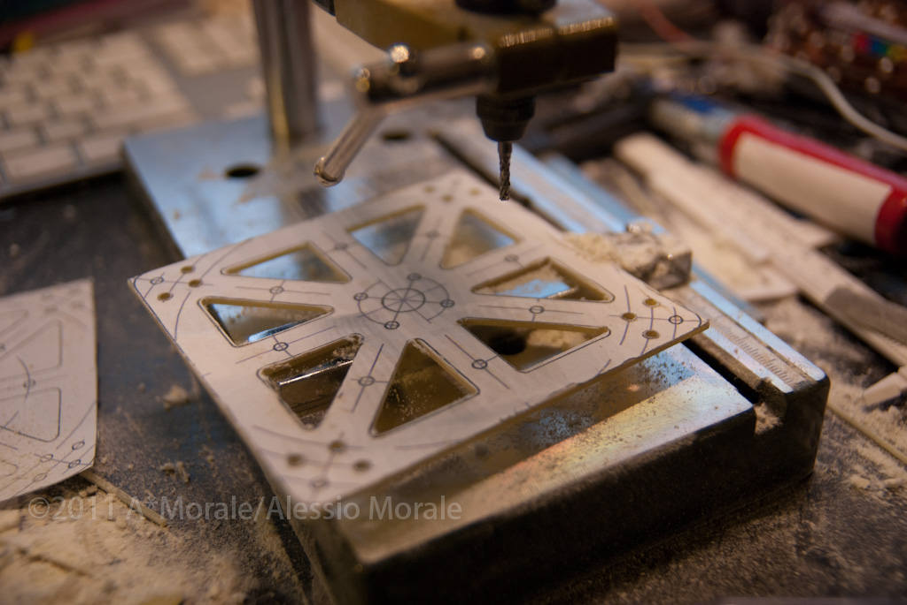
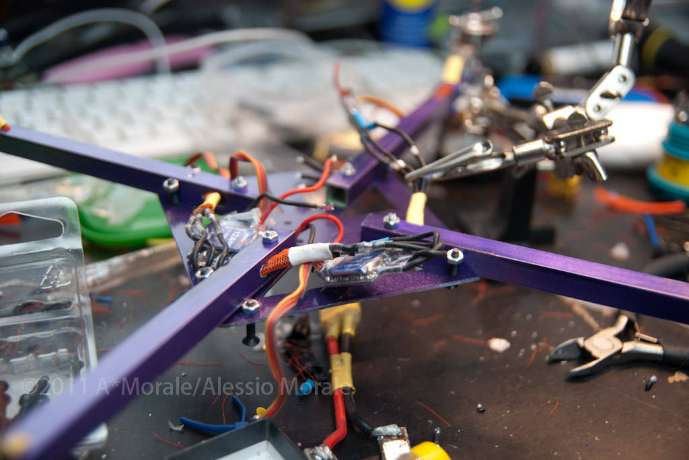
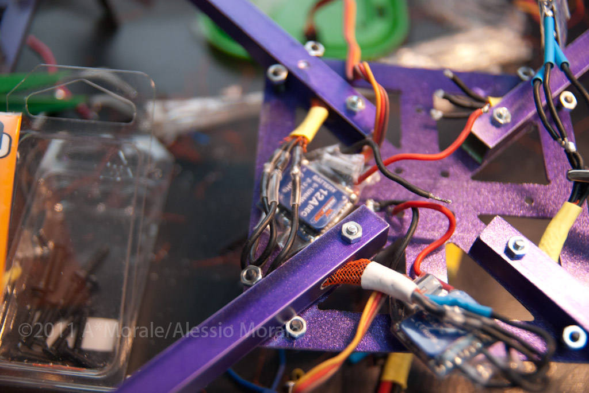
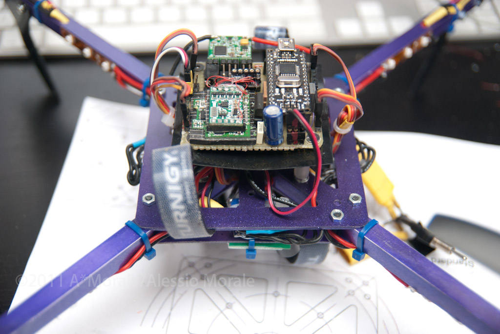

Saturday i had an accident with my quad: a motor stopped in mid air turning the quad into some sort of comet that broke in the ground breaking 3 motor mounts and 3 props and slightly bending the frame.

So it was time to transfer all the motors and elctronics to the new frame, i built some days ago just to test my new proxxon drill stand 🙂

This time I made a slightly larger central frame&#8217;s plates measuring 100x100mm and switched to a X configuration. The arms are, like I did  before, made from 10x10mm aluminum square tube but it&#8217;s a little larger than the previous one: motor to motor distance is now 400mm.

Following are some pictures taken in the various building stages, while milling the center frame plates from a 1.5mm thick glass fiber/epoxy plate and while assembling and wiring the arms to the central plates.

