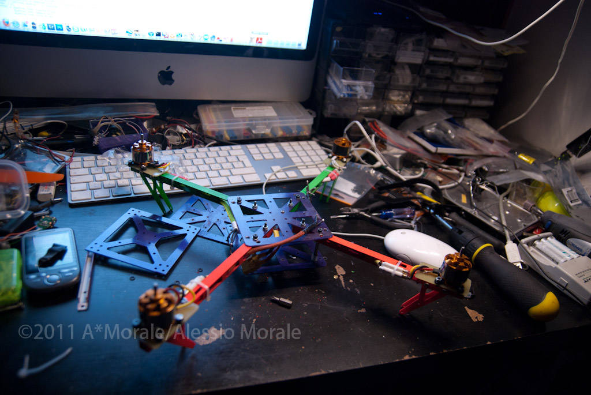
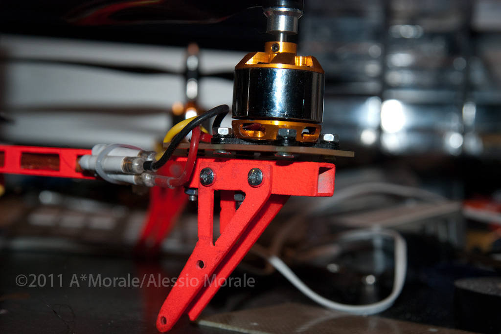

I decided to change motor/esc and completely review my quad.

The new motor are self wound 2212 motor from Giantcod wired with 10 turn ~~Y~~ delta (Y connection revealed too low kv for 10x4.5 or 10x6 and 3s and delta was exactly the needed configuration) connected 0.45mm wire. It will use 10x4.5 EPP or [10x6 GWS dd](http://www.hobbyking.com/hobbyking/store/uh_viewItem.asp?idProduct=11325&aff=353035) propellers. it will use [15-18 SS Esc from Hobbyking](http://www.hobbyking.com/hobbyking/store/uh_viewItem.asp?idProduct=6456&aff=353035).

This quad will be mainly used for fpv and to carry some light compact camera. This will be the airframe to be powered with a future ARM based flight control but now is powered by [Multiwii](http://www.multiwii.com) flight control software on an arduino based boad..

The old [hxt2730 motors](http://www.hobbyking.com/hobbyking/store/uh_viewItem.asp?idProduct=2069&aff=353035) and [12A blueseries ESCs](http://www.hobbyking.com/hobbyking/store/uh_viewItem.asp?idProduct=11429&aff=353035) are now powering a little quad weighting almost 340gr with 2S1000 lipo.

