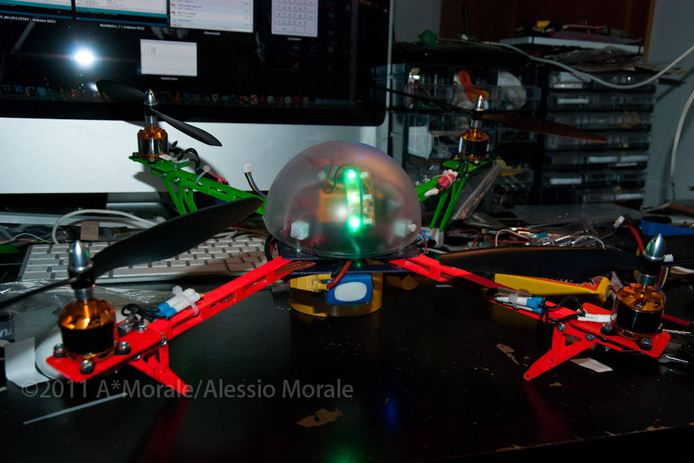
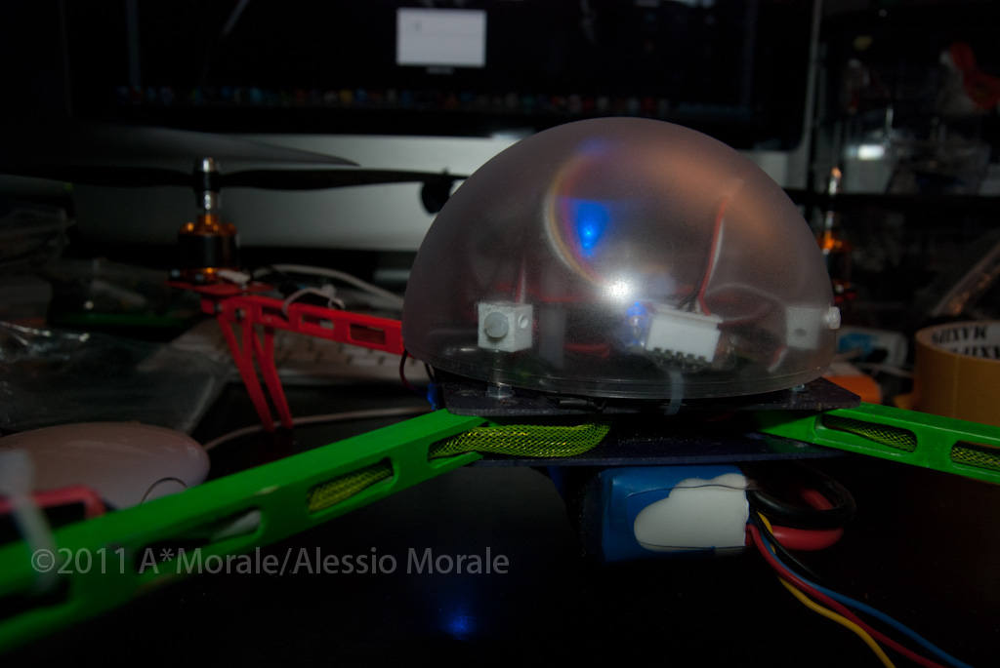
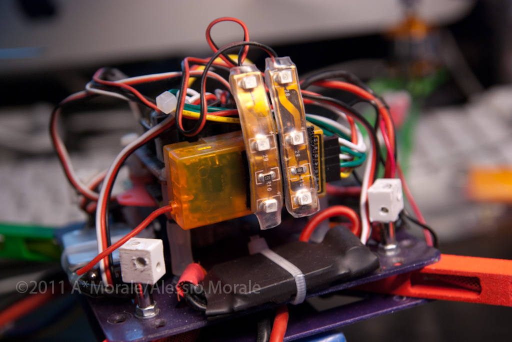

Here are some updated pictures of the finished quad.

I did some little modification like the bottom plate now attached straight under the arms, and the motors were wound as 10turn Delta instead of Y because the previous configuration had too low maximum thrust. now its perfect.

here is some picture.

