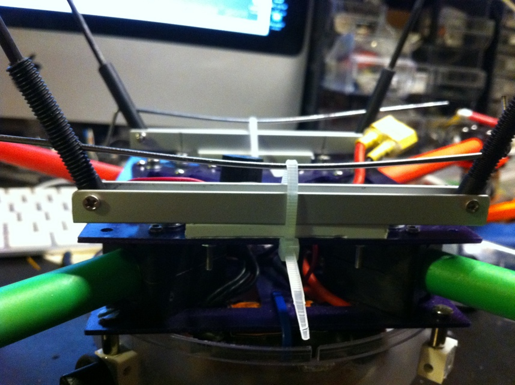

Here is the first attempt for my new landing gear:  
This is in it's working position.

It is build of two U-shaped aluminium pieces that holds in place the and forms the pivoting system for the landing gear arms.

Two linear springs made of stainless steel holds the arms in place when in working position.

The arms are pivoted using a cilindrical nylon piece with the necessary holes in it.

here you can see how the spring hold it together when in working position.

Here the two metal springs are removed so you can easily put the quad in you trunk without risk to break anything:

