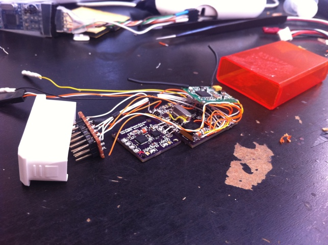

I built this mini control board based on MultiWII to stabilize a new quadricopter I'm working on.

This quad will use the common hxt2730 motors (rewound for the propellers it will spin with a 2S LiPo) and will have a V tail tw0 5.5x4.5 counter rotating APC propellers and two gws 8x4 front propellers.

the frame will be made from carbon tubing using kite joints

Here is the electronics: in the bottom from left there is the imu and control board. Over the control board there is a shrunk HobbyKing DSM2 receiver

This is a zoomed version of the previous.(the quartz was been replaced with an smd one, i was waiting for it to arrive)

