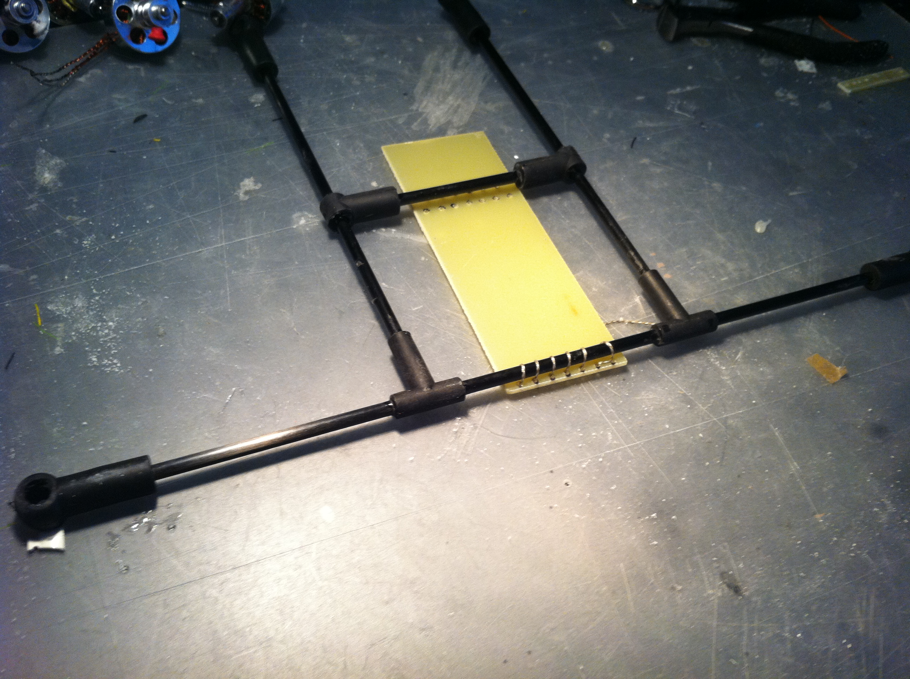
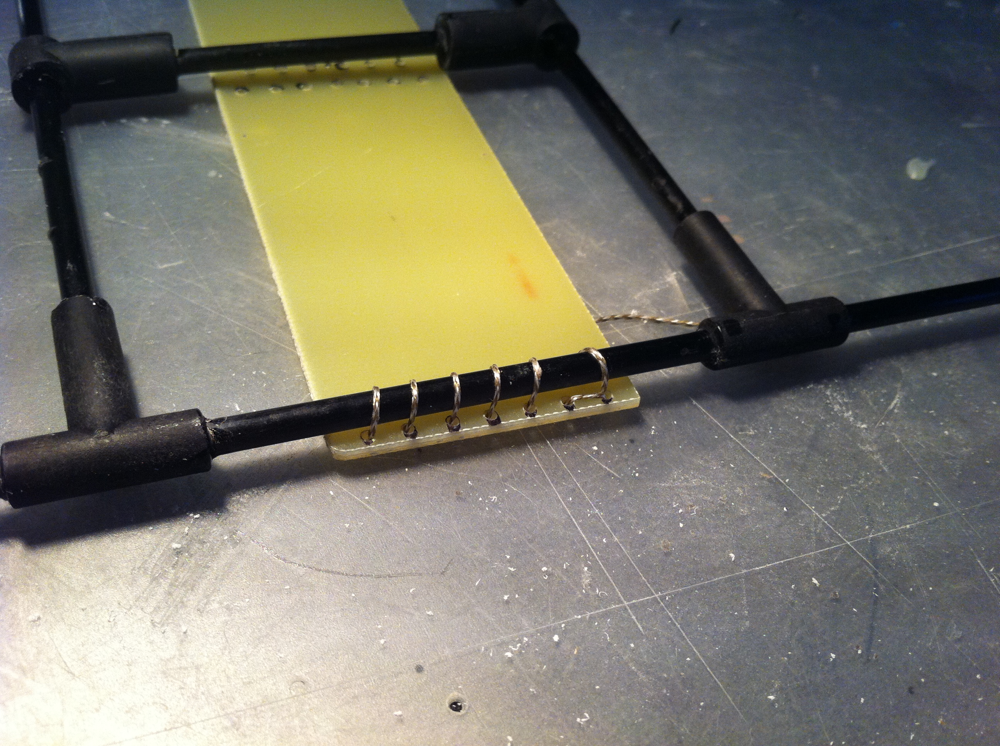
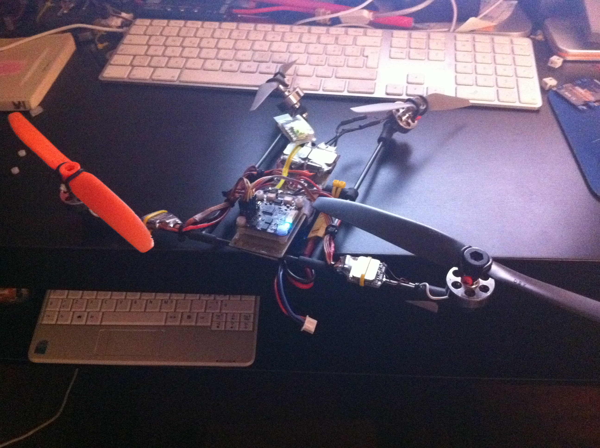

I have problem with my bigger quad (one esc does weird things raising throttle) so i cannot fly for now.  
So It was time (while waiting for my holidays) to finish a mini vtail quad I had in mind for a lot of time.  
I is basically built around some 4mm carbon fiber tubing and some kite rubber joints.  
I used a 4mm kit and a 6mm kit. The 6mm provied the joint used to hold the four motors while the 4mm was used for the remaining joints used to build the structure.

Here is the base frame composed of carbon tubing and a little glass fiber rectangle.  
The rectangle was epoxy'ed to the tubes after it was tied using some  wire. In the rectangle there are four rows of holes used to let the wire passing through it.

Here is better shown how it is tied.

After the base frame was ready I started to put the electronic on it. Here there are two escs, a simple ditribution board and the CopterControl that will power the Vquad.

In this pictures it is almost complete. all the wirings were done and all is ready for testing motors.

Here is another pictures with propellers. all is wired  (There is also the Bluetooth module i used to configure the CopterControl and test motors  without the need for the usb cable)

Now the last  missing piece is the adapter (a simple 3.3V power regulator) needed to attach a Spektrum satellite receiver to the CopterControl. I hope to finish it tomorrow to be able to do  some flying tests with the newborn VQuad 😉

Edit:

I forgot to put the specs of the quad as is now:

- Motors: 4 [hxt 2730](http://www.hobbyking.com/hobbyking/store/uh_viewitem.asp?idproduct=2069&aff=353035) rewound as 10turns wye for the two in front (with [gws 8x4 propellers](http://www.hobbyking.com/hobbyking/store/uh_viewitem.asp?idproduct=11331&aff=353035)) and 10turns delta for the two rear motors (with 5.5x4.5 APC propellers)
- ESC: 4 [12A hobbyking blueseries](http://www.hobbyking.com/hobbyking/store/uh_viewitem.asp?idproduct=11429&aff=353035)
- Tubing is 4mm carbon fiber tube (used for kites)
- Joints are from 4mm and 6mm kite joint kits
- Battery is a [2s 1000mah 25c Turnigy nanotech](http://www.hobbyking.com/hobbyking/store/uh_viewitem.asp?idproduct=11900&aff=353035)
- Orange [Sat Receiver for Spektrum](http://www.hobbyking.com/hobbyking/store/uh_viewitem.asp?idproduct=13418&aff=353035)

Weight is a little less than 300gr with battery.

Update: Here is a video of the first test done:

`youtube: https://www.youtube.com/watch?v=JVOamvZ_YXc`
