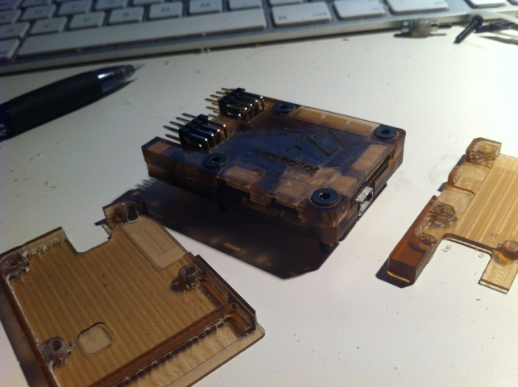
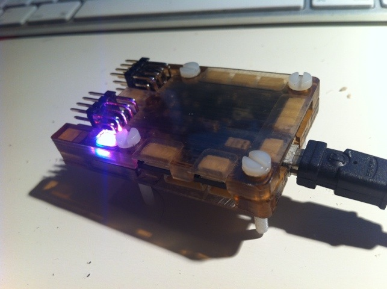

Here is a new case for the upcoming Revolution board from the awesome OpenPilot project.  
The case is built by two shells 5mm thick made by polystyrene glass.  
It is milled with 3mm two flute endmill at 900mm/min feeding rate and 1.5-2mm depth. You also need to cool down the mill from time to time to prevent the polystyrene from melting. Just spray some water on the mill while it's cutting.

