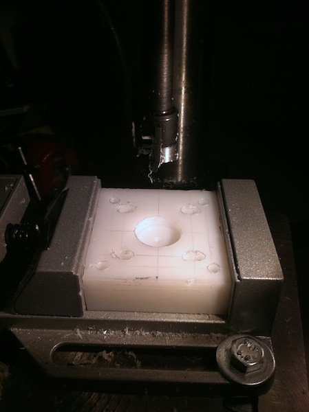

Le guide per X e Y sono lunghe 450mm;  
In effetti la barra che supporta la chiocciola nel disegno è piuttosto sottile: Si tratta di una barra 25x3mm di acciaio (l'avevo già) ed è uno dei punto che sicuramente modificherò se ha troppo gioco (provo prima di tutto a sovrapporne un'altra uguale distanziata di un paio di millimetri, altrimenti passo direttamente ad un profilato in ferro o acciaio.

I supporti delle chiocciole, dei cuscinetti e dei motori sono ricavati in HDPE, dato che posso facilmente lavorarlo con gli strumenti che ho.  
Sono riuscito a trovare una punta regolabile da 16 a 40mm che userò per le sedi dei cuscinetti.  
Dopo qualche prova per trovare il diametro esatto il risultato che ho ottenuto è stato più che accettabile.  
Le chiocciole saranno fatte in tondo di delrin da 16mm assicurato mediante due grani M5 ai supporti in HDPE, così da semplificarne l'eventuale sostituzione.

Il ponte è quasi completo (a meno dei fori per la barra filettata che completerò nei prossimi giorni).  
Ho montato il tutto per verificare che non ci fossero problemi:  
Ho dovuto soltanto aggiungere delle rondelle dietro ad un cuscinetto lineare per via del fatto che le piastre non sono rettificate. Fatto questo scorre molto fluidamente, anche se devo ancora regolare la posizione sul profilo delle due barre supportate.

Il prossimo passo sarà il carrello con l'asse Z.


## 25 Ott 2011

Ieri ho configurato un vecchio portatile con Linux EMC2 con tutti i settings per una delle classiche schede cinesi tre assi con TB6560A.  
Rimuovendo alcuni pacchetti/servizi non necessari funziona anche con AXIS anche con soli 128 mega di ram(non avevo ancora altra roba con parallela a casa).
Ho dovuto disattivare l'accelerazione OpenGL perchè provocava il blocco totale del sistema come scritto [quì](http://wiki.linuxcnc.org/emcinfo.pl?TroubleShooting#Installing_Software_based_OpenGL)

Prossimamente farò dei controlli/modifiche alla scheda per, oscilloscopio alla mano, riguardanti alcuni problemi di velocità, perdita di step ecc, come suggerito [in questo post su CNCItalia](http://www.cncitalia.net/forum/viewtopic.php?f=8&t=31444&hilit=TB6560&start=0) e [questo su CNCZone](http://www.cnczone.com/forums/general_electronics_discussion/110986-how_i_fixed_my_chinese.html?highlight=TB6560+chinese)

Dopo aver smanettato un po' coi settings (lo strumento di configurazione non permetteva di assegnare i 3 diversi pin di abilitazione dei canali singolarmente, bisogna fare da file di configurazione .hal), il trespolo ha funzionato ( e pur si muove&#8230;).

## 04 Nov 2011

Rientrato ieri dal lungo ponte, oggi ho ripreso i lavori:  
Ho completato i blocchetti che porteranno i cuscinetti per le barre filettate e gli stepper:




I cuscinetti sono fatti di in HDPE dello spessore di 20mm, con due fori di diametro 22mm profondi 7mm per l'alloggiamento dei cuscinetti su tutte e due le facce.  
I cuscinetti che sto usando al momento sono dei normali cuscinetti radiali(mantenendoli leggermente in tensione per ridurre il gioco). Aspetto che mi arrivino gli assiali per sostituirli.

Questa invece è la soluzione per far funzionare la classica scheda cinese 3 assi con tb6560 alla quale ho eliminato i circuiti di riduzione corrente a riposo e gli optoisolatori (inutili e dannosi, dato che non è realmente isolata dal pc):

- Creata una configurazione base con stepconfig escludendo i pin di abilitazione(in questa fase non funzioneranno ancora);
- Aggiunte le seguenti tre righe al file config.hal nella directory creata da stepconfig

```
net xenable => parport.0.pin-14-out
net yenable => parport.0.pin-02-out
net zenable => parport.0.pin-06-out
```

- A questo punto si può riprendere stepconfig per aggiustare le impostazioni (sta volta gli stepper funzioneranno).
