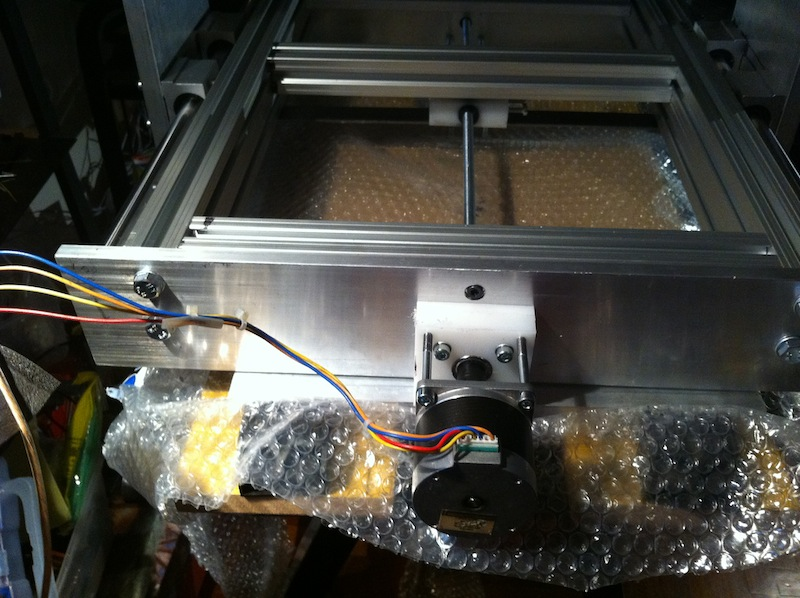
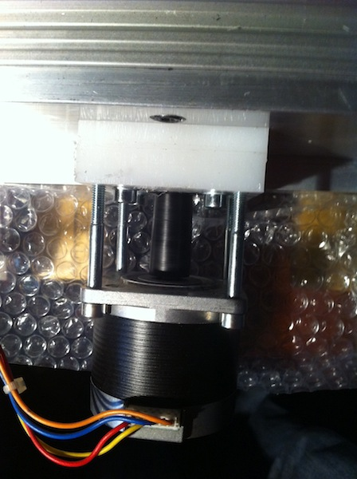

Stasera sono riuscito a completare la prima chiocciola con supporto.

le viti laterali visibili in foto servono a bloccare la chiocciola al suo interno. Sto valutando se potrebbe essere utile fare un taglio sulla chiocciola per poter usare le viti anche per ridurre il gioco (ma penso che per quando mi servirà sarò già passato alle viti trapezoidali).

Il motore è stato fissato temporaneamente con quattro bulloni solo per verificare il funzionamento dell'ambaradan

Questa è la scheda driver (devo ancora saldare i ponticelli che ho messo al posto degli optoisolatori).

Al momento ho ottenuto poco più di 900mm/minuto con le viti M8

ecco il catorcetto su cui ho montato EMC2 🙂

In fine la minitastiera che sto usando per comandare EMC2 stando lontani dal portatile 🙂

