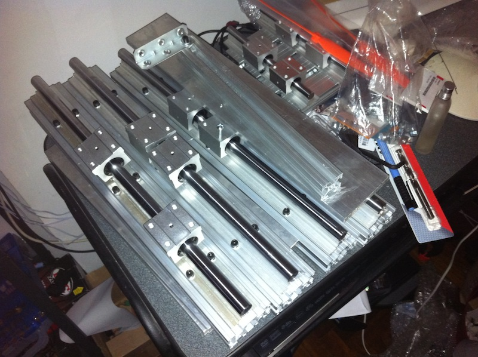
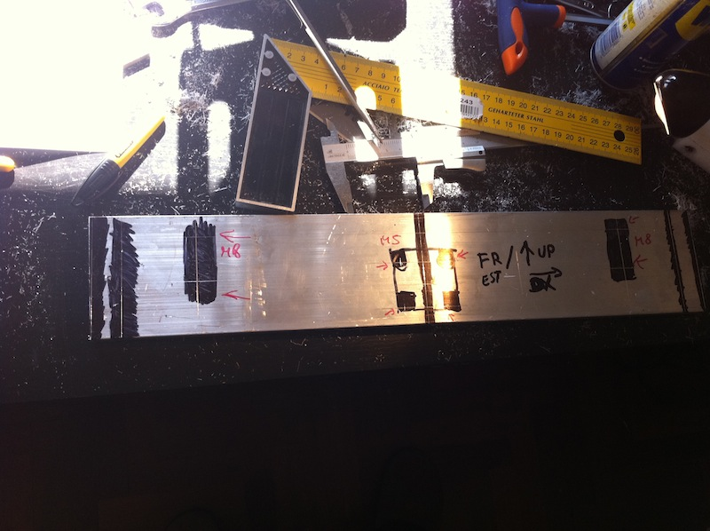
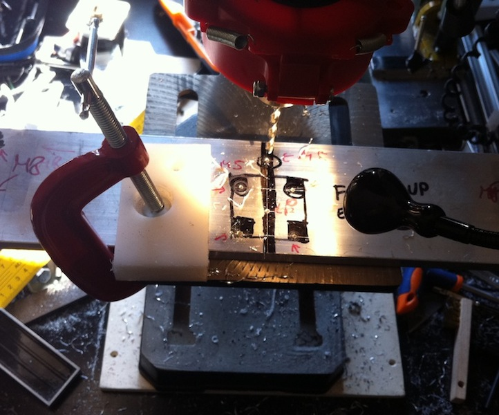

Nota: Il post deriva da un mio [post su CNCItalia](http://www.cncitalia.net/forum/viewtopic.php?f=25&t=34160)

Eccomi alle prese con la mia prima realizzazione.  
SI tratta di una semplice tre assi per la cui realizzazione mi sono basato sulle seguenti linee guida:

- Aree di circa 300x300mm
- Taglierà principalmente materiali compositi, materie plastiche e qualche cosetta in alluminio, nulla più.
- Deve essere possibile realizzarla con dell'attrezzatura piuttosto limitata (non ho un box o posto dove mettere qualcosa tipo una fresa…) ovvero trapano a colonna del Leroy merlin da 60€ qualche attrezzo manuale (truschino, calibro ecc.).
- economica.

Francamente era un mondo semisconosciuto, quindi ho cominciato(verso fine agosto) a documentarmi basandomi sui vari progetti visti qui e su cnczone.  
Gli step successivi sono stati studiare Inventor e capire che materiali potevo utilizzare. Dopo varie idee malsane (tra cui usare l'hdpe…) ho optato per una soluzione piuttosto semplice:

- Guide supportate da 16 per X e Y e 12 per Z (acquistate da linearmotionbearing);
- Profili strutturali 30x60 (acquistate da cncstore) per montare le guide di X e Y e per supportare la tavola(ancora da definire);
- Frontali in alluminio (anticorodal 6082) da 10mm e laterali (ponte) da 15mm(acquistate da pontecorvo, qui a Roma);
- Come prime prove barre filettate M8, appena potrò usare un tornio, saranno sostituite con barre trapezie da 14 o 16mm;

Questo il disegno della macchina (manca solo l'azze Z che sto completando):

Queste alcune fasi iniziali dell'assemblaggio

