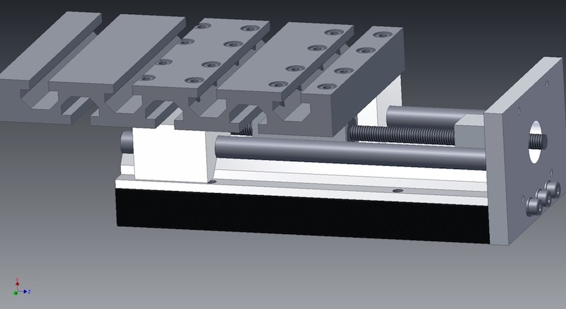
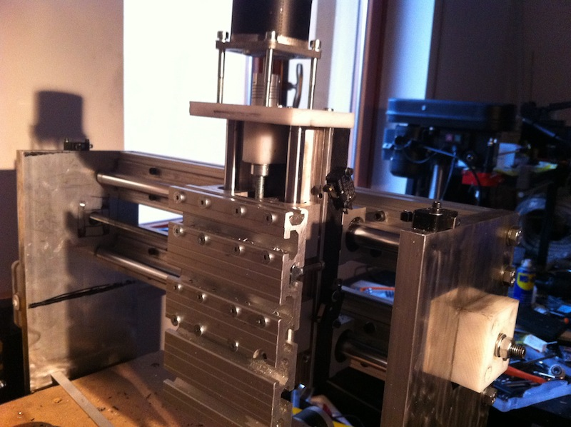
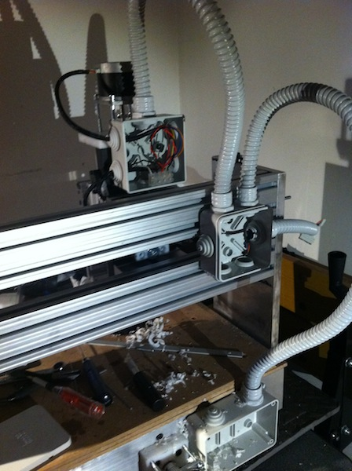
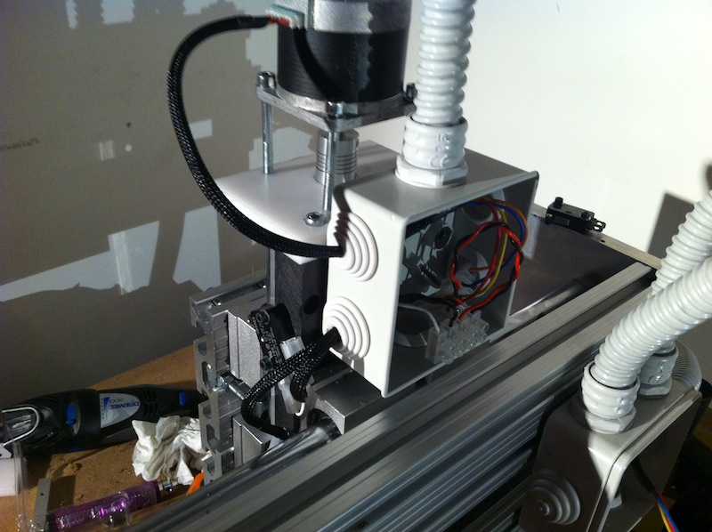
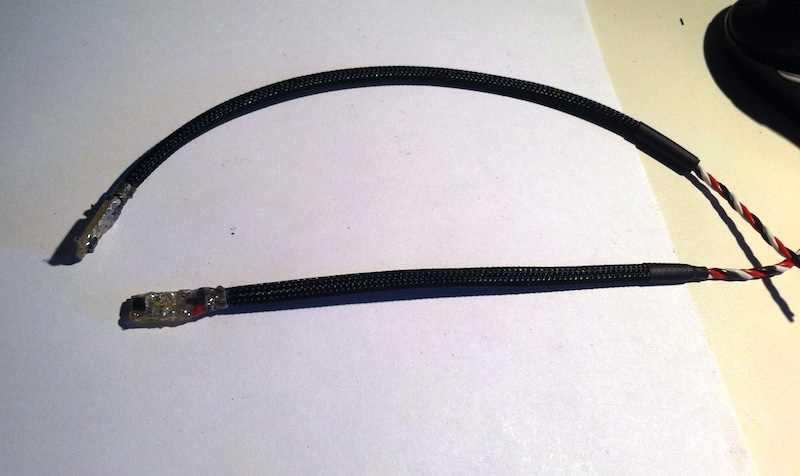
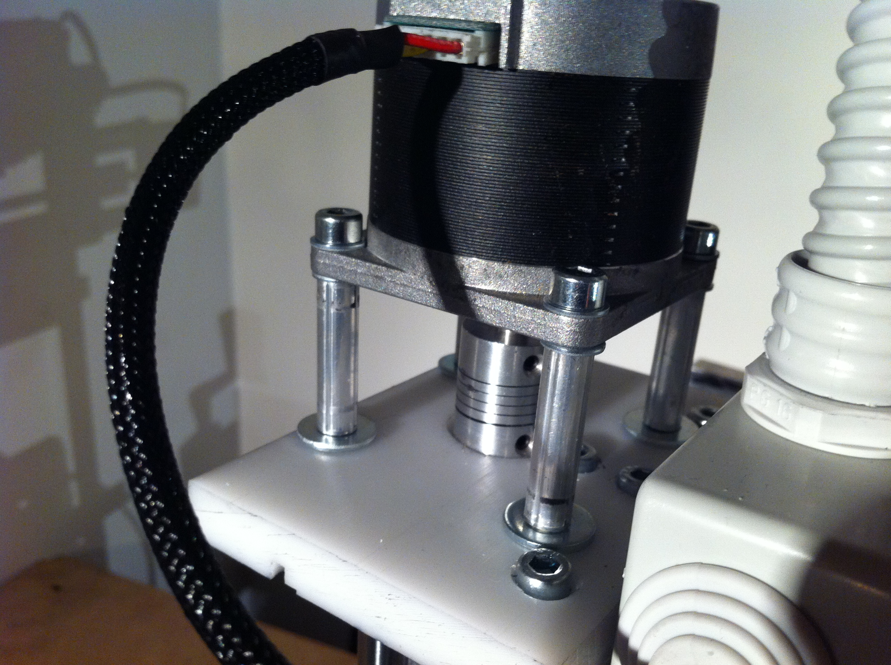

Ci sono diversi modi più semplici per aggiungere dei tasti mappati direttamente su tastiera ad un comando remoto:  
questo è un esempio:  
http://www.obdev.at/products/vusb/hidkeys.html  
Si tratta di un semplice circuito a microcontrollore AVR che emula una tastiera e che dispone di 17 tasti.  
Dal pc viene visto come una classica tastiera USB, quindi non è necessario alcun driver e nessuna configurazione del software. Basta personalizzare il firmware e associare ai vari tasti le combinazioni di caratteri necessarie.

Ecco il progetto completo della prima versione del carrello della Z:

Il lato con la piastra è, ovviamente, quello a cui collegherò lo stepper.  
Immediatamente dietro la piastra c 'è un blocchetto che contiene i due cuscinetti assiali su cui è montato l'albero filettato.  
Sulla piastra con cave a T sarà montato l'utensile.  
Come accennato in precedenza, questa sarà la "prima fase " della CNC che, una volta montata e funzionante, mi permetterà di lavorare le parti per eventuali miglioramenti alla struttura attuale.

Terminata la Z, i passi successivi saranno il montaggio dei fine corsa, dei sensori di home ed il cablaggio.

--

Ho finito di assemblare il prototipo, e in effetti non è stata una grandissima idea quella di usare la piastra con cave a T. l'idea era quella di essere flessibile nell'utilizzo di vari utensili (fresa o al limite anche estrusore per utilizzarla come "reprap").  
Ho incontrato anche problemi nel cercare di ricavare le sedi incassate per i bulloni. Tra il gioco che ha il trapano e la lunghezza della punta è impossibile riuscirci.  
Comunque per il momento l'ho assemblata così.

---

Tutti i cablaggi sono stati completati, posizionati tutti gli switch dei limiti e tutti e tre i sensori di home (mancano solo i magnetini che dovrebbero arrivare lunedí)  
sono riuscito a configurare tutto su EMC (anche se devo studiarmi meglio tutta la configurazione dell'homing degli assi).

Ho fatto pure una prova a comandare il controller brushless da modellismo che userò per il mandrino da EMC:  
Sembra funzionare discretamente bene anche se anche li devo approfondire la configurazione dei segnali per lo stop (allo stop toglie semplicemente il sengnale, per un controller rc non è l'ideale, così si spegne dopo circa 2-3 secondi).

Ho fatto alcune modifiche sulla scheda driver cinese: adesso l'alimentazione dei motori arriva ai driver dopo quella della logica, come prescritto dal datasheet. In questo modo non dovrebbe esserci rischio di bruciarla all'accensione, come pare molte abbiano fatto (appena riesco a buttare giù uno schema da allegare alle foto posto pure questo).

Qui un video di un test sullo spostamento (come previsto piuttosto lento, circa 700mm/min max , il prossimo passo saranno le viti a ricircolo) degli assi: http://youtu.be/D9PupScOtws  
E questo invece il test del meccanismo di homing su EMC2:

`youtube: http://youtu.be/VL88nluXFMo`

---

Ancora ho diverse cose da finire (tipo dare un aspetto dignitoso al mandrino).

Ecco qualche video.  
Spianatura di un piccolo ripiano portapezzi che sto usando per fresare alcune parti per il mandrino:

`youtube: https://www.youtube.com/watch?v=qf7DA2whZWA`

purtroppo avevo solo una fresa da 3mm, ho già ordinato colletti e fresa da 6

Foratura del ripiano per avvitare le piastre di bloccaggio dei pezzi:

`youtube: https://www.youtube.com/watch?v=hBRCIHwpm2s`

Ho dovuto abbassare la velocità della punta per non far attorcigliare i trucioli di hdpe altrimenti l'avrei dovuta ripulire ogni 5-6 fori.

Per il gcode relativo alla spianatura e per la foratura ho usato [questo quì](https://github.com/linuxcnc/simple-gcode-generators)

Mi sa che passerò presto a delle viti vere, troppo lenta:)
