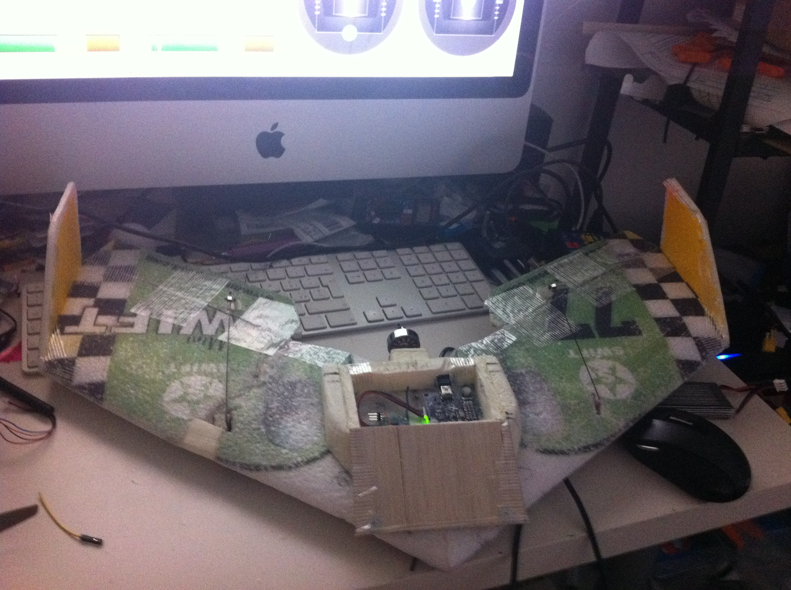
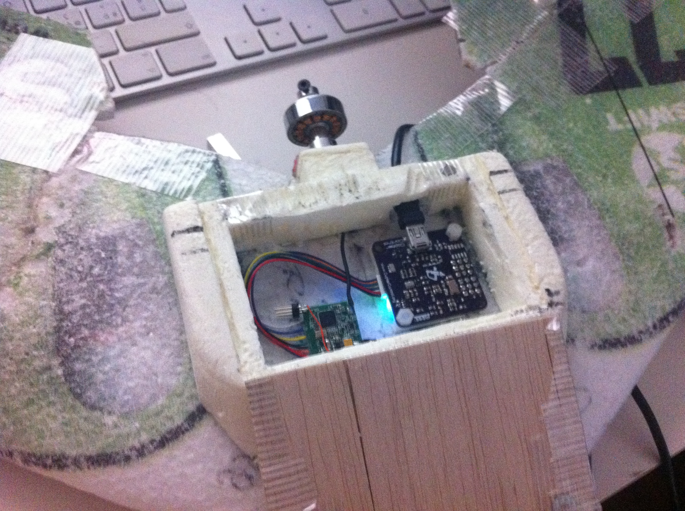

After a huge amount of crashes with my mini swift, i eventually decided to rebuild it creating an hatch in the top where I can put a CopterControl and, in a near future, GPS and PipXtreme on it.  
The little thingy is not really light as I put a hxt 2730 motor (25gr motor only) with a 2S 1000mAh LiPo. The total AUW is around 225gr.

