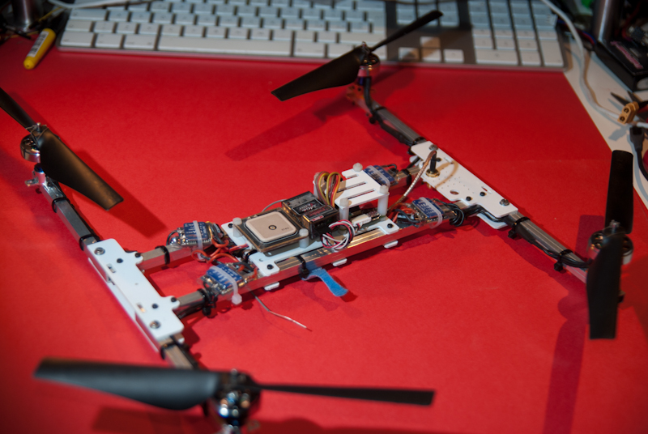
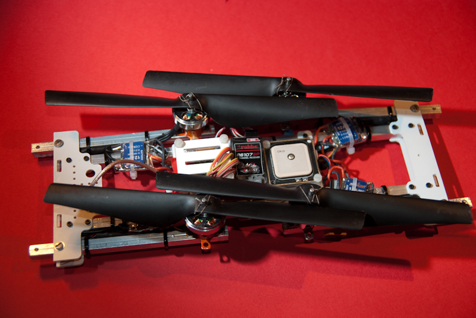

Here are the drawings for a mini-H I built some time ago.

it can be easily folded to be put in a backpack.

The design was built using the following materials:

#### Main center frame assembly

- n° 14 M2x16 hex socket bolts
- n° 12 M2 nuts
- n° 8 M2 self locking (nylock) nuts
- n° 14 M2 washers

####  Arm assembly

- 4 M3x16 Stainless steel bolts
- 4 M3 self locking (nylock) nuts
- 8 M3 washers
- 8 M2x16 (but should be shorter) bolts for motor mounts
- 8 M2 self locking (nylock) bolts
- 16 M2 washers

#### Board mounting

- various M3 nylon spacers/bolt/nut and M3 polycarbonate screws

#### Power stage

- 2730 1300Kw blue wonder from [giantshark](http://www.giantshark.co.uk/blue-wonder-1300kv-micro-brushless-outrunner-motor-p-402398.html)
- HK blueseries 12A Esc flashed with simonk firmware,
- ARDrone propeller set modified cutting the various pins on the back and enlarging the hole to 3mm.

To attach the props i removed the prop saver, inserted the prop on the axle and tied using some thin multifilar fishing line and that works great.

I use it both with 2s 1300 for indoor testing or 3S 2200 for outdoor fun.

Refer to this thread for further information and for asking questions: <a href="http://forums.openpilot.org/topic/12600-open-frames/page-17#entry150264" target="_blank" rel="noopener noreferrer">link to OpenPilot forum</a>

[Link to design files](hquad.dwg_.zip)
