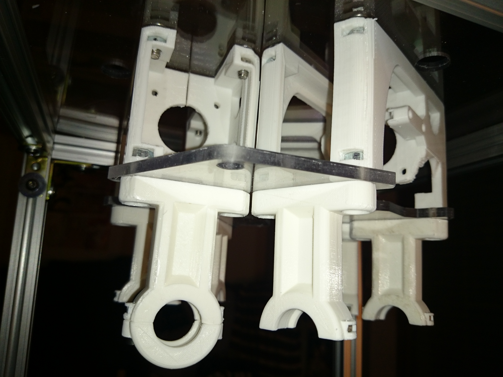
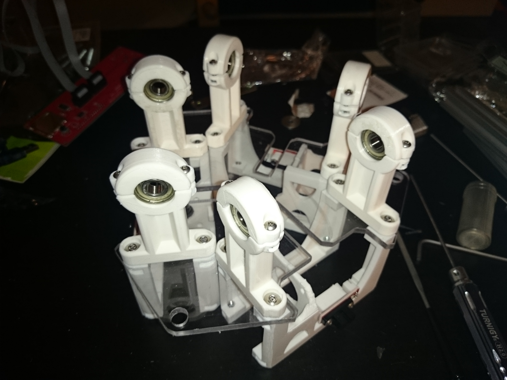
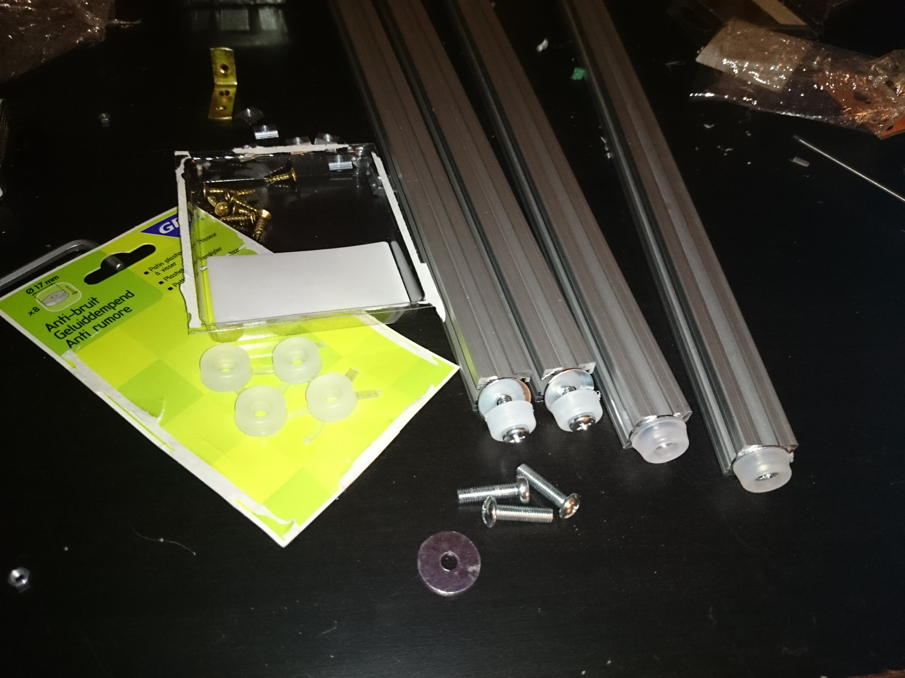

(thanks to Juha, from the FirePick Google group ) I got the printed plastic parts.

after a minor cleanup of the captitive nuts seats. here is part of the delta mechanism assembled:

Then it is the turn of the three arms secured to the bearing using nuts and washers. I used nilock nuts to prevent them from untightening

A simple solution for feets: they are 19mm round soft plastic feets, sold in group of 8 for around 2€, and are used to be fitted in chair legs to dampen noise caused by moving them. With a bit of work an M5 bolt does fit nicely. I added a large washer to spread the weight evenly on the feet and prevent it to be ruined by the alu profile's sharp edges.

Now it is time to wait for some other pieces to arrive, the most important being steppers and angle brackets.
