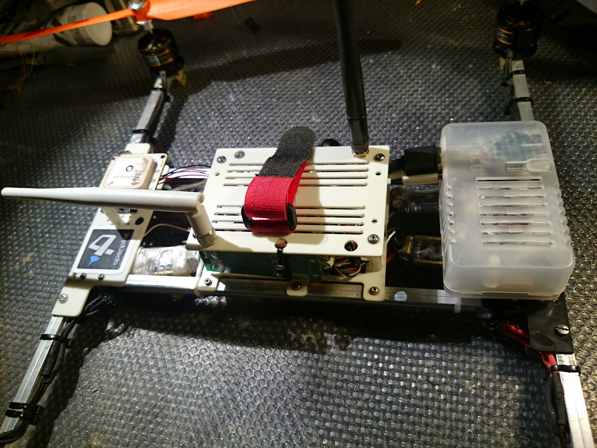
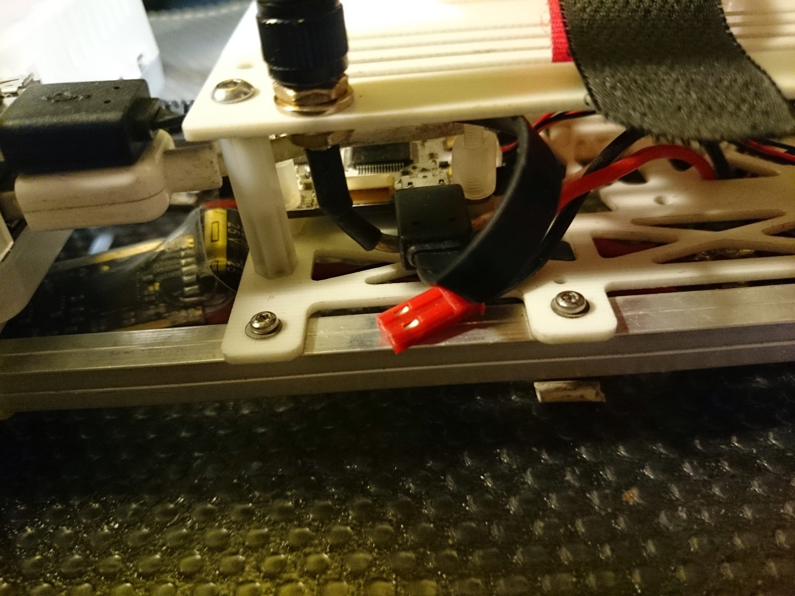
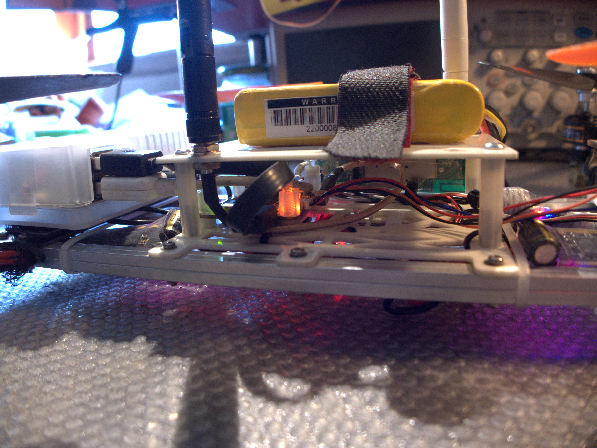
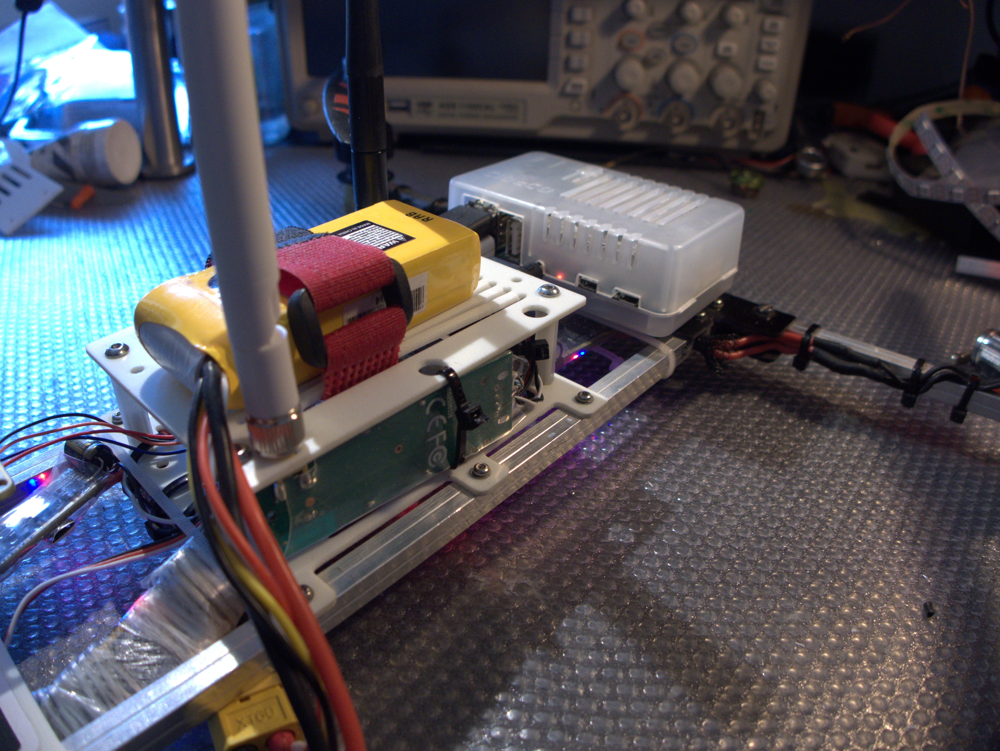

I'm shortly going to work integrating the OpenPilot telemetry with ROS.

Main (long term) focus is indoor positioning and navigation.

This is a quick mockup of the craft that will be used. Plates are going to be rebuilt to better host everything

The reference platform  is made by

- OpenPilot Revolution flight controller;
- OpenPilot GPSV9 with integrated magnetometer;
- Control link using Revolution on board OPLink;
- ODroid U3 sbc hosting Ubuntu server 14.04 with ROS Indigo;
- WIFI card TL-WN722N (that uses an external antenna connected with a RPSMA);
- USB Web Cam, initially used for optical flow.
- Telemetry link using WIFI connection;
- Connection between Revolution and Odroid using USB.
- Sonar sensor for precise agl measurement
  

