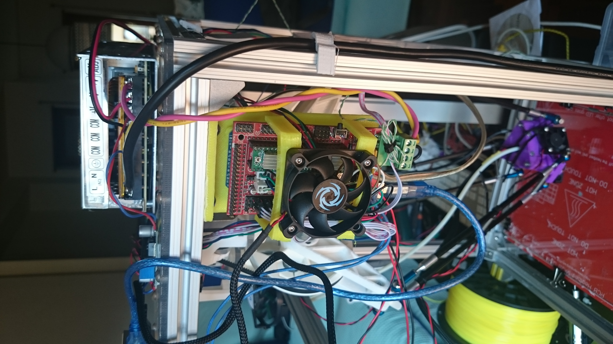
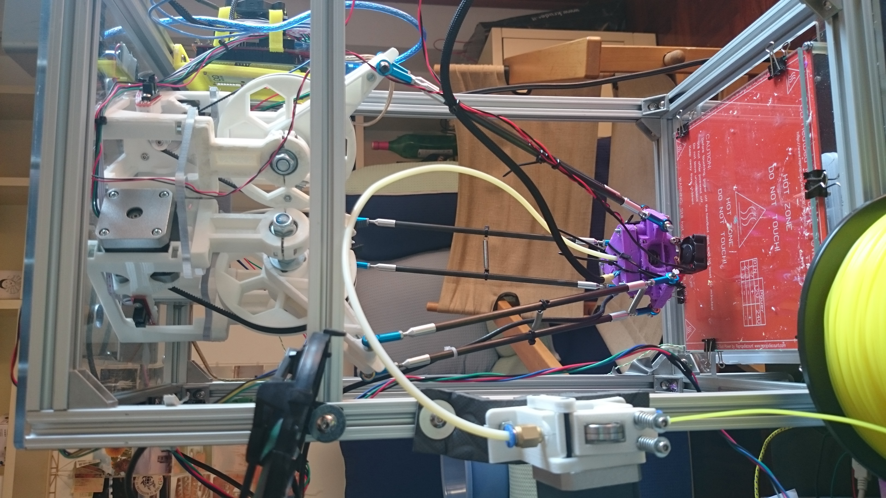

It is now since several weeks that my Firepick has already started working as a 3D printer.

There are some (expected) issues with calibration that i had not yet time to solve, this make a bit difficult to print large objects as the head does not move on a perfect flat plane but goes down when moving away&nbsp;from bed center point.

Right now it is working with an Arduino mega/ramp and the [modified Marlin firmware](https://github.com/firepick-delta/Marlin).

In the process of printing the updated end effector mount for 3d printing hot end

Updated end effector and 3D printing hot end mount.

