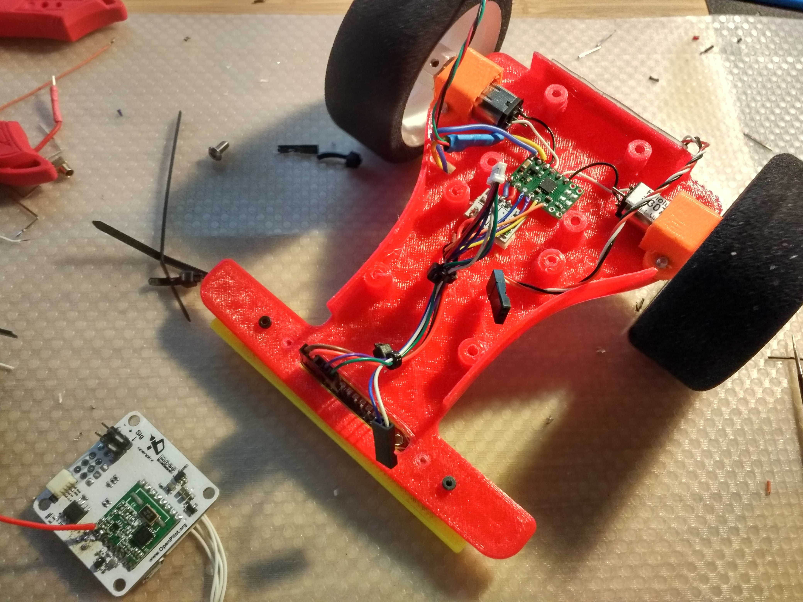

Spending time with the guys at [Officine Robotiche](http://www.officinerobotiche.it/) (a huge thank to Stefano [Artigianato Robotico](https://www.facebook.com/ArtigianatoRobotico)), I've discovered the world of line followers. Apparently simple robots whose ultimate goal is to, guess what, follow a line 🙂

This simple task involves several issues:

- reading sensors to determine the line displacement;
- employing a control algorithm to determine the movement vector;
- motor control;
- several other ancillary stuffs, like telemetry, etc;

Obviously mine will run LibrePilot 🙂 and that simplifies a lot of things as most of the component needed are either in place or needs minor rework.

Unfortunately I had no enough time to make a custom board so I went for some ready stuffs for sensor board and motor driver. Thanks to Stefano 's suggestions and after fiddling with their datasheets I ended with the following component list:

- [1:30 gearmotor](https://www.pololu.com/product/2212)
- [DRV8833 dual motor driver](https://www.pololu.com/product/2130)
- [QTR-8RC Reflectance Sensor Array](https://www.pololu.com/product/961)
- [12mm hex wheel adapters](https://www.pololu.com/product/2682)
- soft foam 1:12 RC Car wheels bought at a local store (yes, the ones with real people you can talk to 🙂 )

It will be based on OpenPilot Revolution board given it has plenty of I/O and RF module onboard, useful for tuning and telemetry.

I've also left some mounting holes that may host a NanoPI neo. One day it will be used for optical recognition for, i.e. better line speed planning.

This is the frame I made for this robot

It is made of two parts, the main frame structure and sensor housing. It is available for download at Thingiverse (<http://www.thingiverse.com/thing:1792422>)

I used PETG for the main part and PLA (that is hard and have very low friction).

And here is a short video of the thing moving for the first time, using a standard RC transmitter (and related receiver) for control. It is already using gyro for yaw/trajectory stabilization

There is still a big to do list ahead, including (but not limited to) reversable motors handling and sensor reading.

LibrePilot had already almost everything needed. I added a specific target ( i called that roborevolution based on the revolution target, employing several changes needed to manage brushed motors and all the sensors needed). To have this first test working i only had to tweak the Servo motor drivers to handle higher frequencies and to increase the available resolution.

`youtube: http://www.youtube.com/watch?v=Xo0Zb39PRaw`

edit: [here](https://github.com/AlessioMorale/LibrePilot/tree/amorale/linefollower) is the, still very hacky. source code i 'm working on

edit2: and it works 🙂 until i find some time for a new update post, here are two videos of its first tests

`youtube: http://www.youtube.com/watch?v=EWf0fa_k2FA`

After a bit of tuning 🙂

`youtube: https://www.youtube.com/watch?v=JDx6UnxeB-w`
