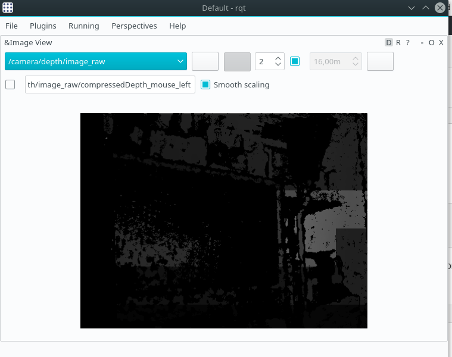

_Update 1st may 2018: added a note to use realsense nodelet tag 1.8.1 and some patches to use ROS built from sources or GCC7._

This post will guide you through the configuration of a Realsense R200 on Odroid XU4. There is nothing strictly related to this platform so they should apply to any armhf/x86 Ubuntu 16.04.xx systems.


Let's start from the requirements:

- an Ubuntu 16.04.xx installation;
- ROS Kinetic ([installation instructions](http://wiki.ros.org/kinetic/Installation/Ubuntu));
- obviously a Realsense R200 🙂

### Preparing the workspace

Skip this section if you have already a workspace.

If don't, let's do it now (remember to &#8216;source /opt/ros/kinetic/setup.bash' in case you have not added it to your .bashrc):

```bash
mkdir -p ros_ws/src
cd ros_ws/src
catkin_init_workspace</pre>
```

### Prerequisites

Librealsense requires some prerequisites to be built:

```bash
sudo apt-get install libusb-1.0-0-dev pkg-config libglfw3-dev
```

### Cloning the repositories

now it's time to clone the [librealsense](https://github.com/IntelRealSense/librealsense) and the [Realsense nodelet](https://github.com/intel-ros/realsense) repo:

```bash
#librealsense
git clone https://github.com/IntelRealSense/librealsense.git
cd librealsense
git checkout v1.12.1
#setup udev rules. Connect or reconnect the camera the camera after the following two lines are executed
sudo cp config/99-realsense-libusb.rules /etc/udev/rules.d/
sudo udevadm control --reload-rules && udevadm trigger
```

NOTE: if using ros built from source (and not installed under /opt/ros/\* apply the following patch to librealsense:

```diff
diff --git a/CMakeLists.txt b/CMakeLists.txt
index d6ed86e1..784da760 100644
--- a/CMakeLists.txt
+++ b/CMakeLists.txt
@@ -37,10 +37,8 @@ assign_version_property(PATCH)
 set(REALSENSE_VERSION_STRING ${REALSENSE_VERSION_MAJOR}.${REALSENSE_VERSION_MINOR}.${REALSENSE_VERSION_PATCH})
 infoValue(REALSENSE_VERSION_STRING)

-IF(DEFINED CMAKE_PREFIX_PATH)
-  IF("${CMAKE_PREFIX_PATH}" MATCHES "/opt/ros")
-    set(ROS_BUILD_TYPE TRUE)
-  ENDIF()
+IF(DEFINED CATKIN_DEVEL_PREFIX)
+  set(ROS_BUILD_TYPE TRUE)
 ENDIF()

 IF (${ROS_BUILD_TYPE})
```

Also if you are using gcc7 you probably need the next patch as well:

librealsense_gcc7.diff:

```diff
diff --git a/src/types.h b/src/types.h
index 0455c836..ed3b818a 100644
--- a/src/types.h
+++ b/src/types.h
@@ -22,6 +22,7 @@
 #include &lt;atomic&gt;
 #include &lt;map&gt;
 #include &lt;algorithm&gt;
+#include &lt;functional&gt;

 const uint8_t RS_STREAM_NATIVE_COUNT    = 5;
 const int RS_USER_QUEUE_SIZE = 20;
```

Please note that you need to use librealsense v1.12.1 and realsense 1.8.1 with R200 as the support was dropped in later versions.

```bash
#realsense nodelet
cd ..
git clone https://github.com/intel-ros/realsense.git
git checkout 1.8.1
```

### Building and testing

You may move to the root of your workspace (ros_ws) and build it:

`catkin_make -j4`

(j4 is required to prevent the compilation failures due to RAM constraints)

In case of failure check whether it is asking for some dependencies (every distribution  has always a slightly different set of packages preinstalled).

Now you can test if everything is working fine.

```bash
source ./devel/setup.sh
#run the nodelet with default settings
roslaunch realsense_camera r200_nodelet_default.launch
```

Ensure to have ROS Kinetic installed on your pc and to configure properly the odroid XU4 netbios name inside your PC /etc/hosts file (all details for [network setup here](http://wiki.ros.org/ROS/NetworkSetup)).

then you can show the image topics from camera using:

```bash
ROS_MASTER_URI=http://192.168.2.15:11311 rqt
```

Change 192.168.2.15 with the IP of your embedded linux box(Odroid XU4).


