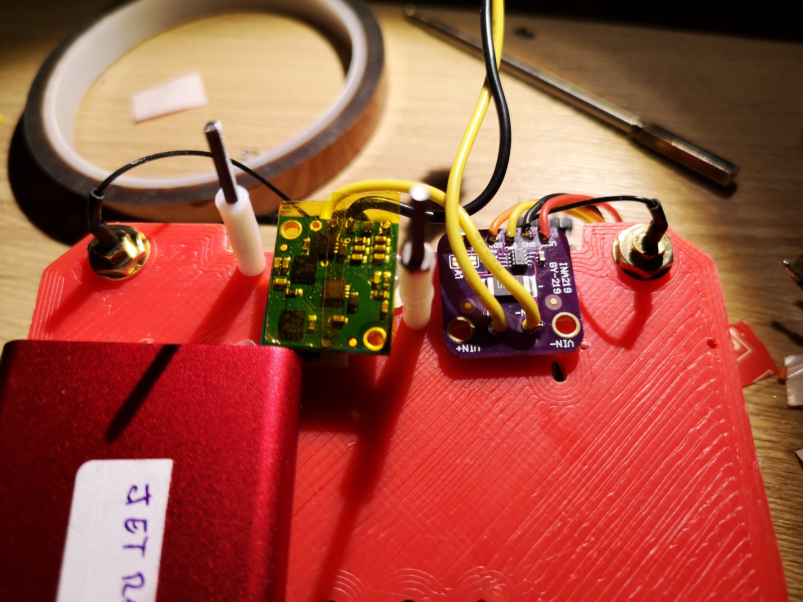
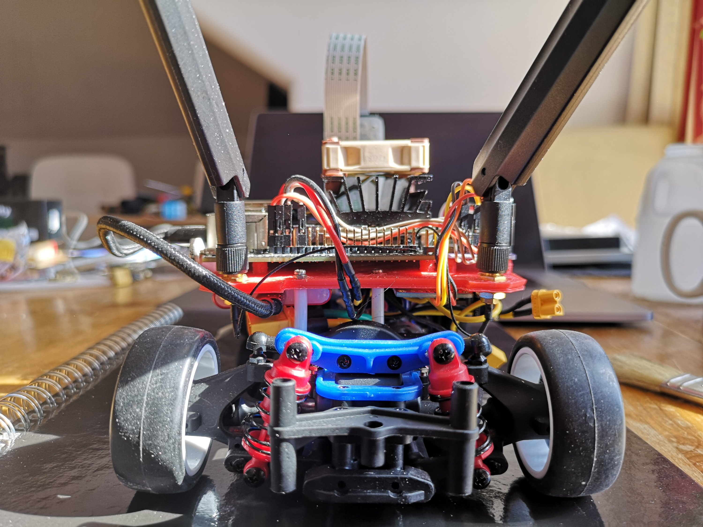

- [Introduction](#introduction)
- [Power supply/monitor](#power-supplymonitor)
- [Remote control](#remote-control)
- [Conclusions](#conclusions)

## Introduction

Some days ago I started this adventure with [JetRacer](https://github.com/NVIDIA-AI-IOT/jetracer).There were a few things that I didn't particularly like from the original design, mainly the fact that Jetson is powered from a USB powerbank (with the additional disadvantages of carrying a lot more weight, having to think about an additional battery and limiting the Jetson power profile to 5W) and the limited remote control possibilities.Beside that I wanted to base the whole system on ROS, so I had to port a few hardware relate nodes to the Nano.

To address such issues I have done some modifications to the original design.

## Power supply/monitor

Power supply/monitorI like the idea to power the whole system from a single source. For this purpose I chose a 2S 2200 mAh LiPo battery that fits nicely with no major modifications in the existing bay.
Battery is connected to a small custom splitting board that allows to connect more devices in parallel to a single source.

A connector is used to connect the Jetson Nano (powered with a small DC/DC). This easily allows to use a power supply during the development and disconnected from the rest of the car.
To suit the power requirements for nano (5V and at least 3A) I opted for a Pololu 2851-FBA, capable of operating from 6V and sourcing up to 5A.Previously I tried another chinese manufactured device just to discover that it needed more than 8.5V to operate, making it worthless with a 2 cells battery.

In addition I have included an I2C current and bus voltage monitor, INA219.Right now it is limited to monitor the Nano current consumption until I change the shunt resistance to a lower value.

**Very important note about INA219 and Jetson nano:** there is another I2C device with address 0x40 (it is something of the same INA family used to monitor board voltage/consumption) connected internally to the same I2C-1 bus, so it is mandatory to select a different address for it. I have used 0x43.

Funny thing is that you can't notice the issue but you will consistently have weird values, until remove the device and realize some thing is still answering your software. To handle this ic I made a few change to an existing node, to use the standard libi2c libraries so it works seamlessly on Nano [https://github.com/AlessioMorale/ros-power-ina219](https://github.com/AlessioMorale/ros-power-ina219)

Next step will be to calculate the integration of current consumption to estimate battery life remaining and moving to standard sensor messages

## Remote control

Considering its functionalities, ease of use and the fact that's widely supported, o opted for a DS4 compatible controller. As a bonus point it has audio output capabilities, that later I want to exploit to communicate the Jetracer status.

## Conclusions

There are a few additional steps that I did, including adding an USB SSD and a few other things that I will address, together with all ROS related setup in a few following posts.I want to close this post with a few additional pictures and a short video of ROS teleop stack working.

`youtube: https://www.youtube.com/watch?v=EyNWCuDqfIA`
