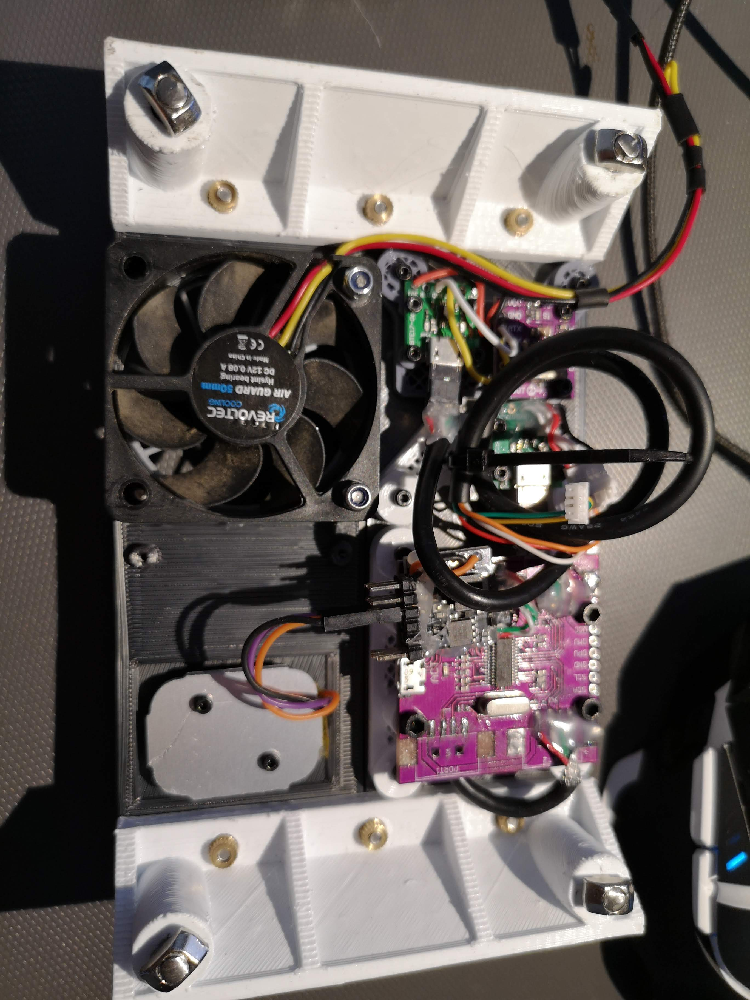

In the last few day I reviewed the design of the top and incorporated a few devices in it:

* A BNO055 IMU and its USB/Serial;
* An uBlox GPS and its USB/Serial (I want to play with its doppler based velocity output that used to be of great help with drones);
* A ws28xx like 2W led lamp, to be used to easily signal status/failures (like battery voltage under a certain threshold);
* An USB Hub that connects to all the devices above to be able to use a single USB cable for the whole assembly.
* A fan that is going to be controlled by UNAV;

