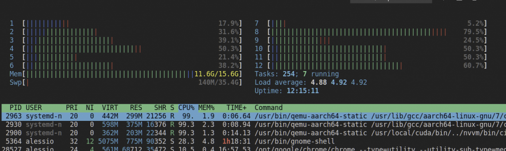

In this article I will show the workflow I'm using to be able to build Docker containers to be deployed on a Jetson Nano using my desktop machine.

- [Rationale](#rationale)
- [QEMU](#qemu)
- [Build images for aarch64](#build-images-for-aarch64)
- [Issues](#issues)
- [What's next](#whats-next)


## Rationale

For some time I was looking at a simple, repeatable solution to deploy my ROS robot software on clean Jetson Nano/Jetpack installation. Wishing to use CUDA enabled version of the various packages where this is available also meant a lot of recompilation effort.
For this reason I searched for a solution to prepare them off-board, either on a desktop pc or even better using CI with Github/Gitlab.

## QEMU

The first issue is the difference in architecture between the desktop machine (a common [x86-64/AMD64](https://en.wikipedia.org/wiki/X86-64) machine) and the target machine, an [AArch64](https://en.wikipedia.org/wiki/AArch64) cpu. Obviously Arm code cannot run on a x86/amd64 thus we need to use some kind of emulation in place.

Fortunately there is a very nice tool that can came to the rescue, it is [QEMU](https://www.qemu.org/).

To install qemu and setup it to run aarch64 code on your machine you need to run the following instructions. the first will install qemu and its prerequisite while the second line register qemu to be able to run aarch64 code using the emulation.

```bash
# Configure aarch64 emulation
sudo apt-get install qemu binfmt-support qemu-user-static # Install the qemu packages
docker run --rm --privileged multiarch/qemu-user-static --reset -p yes # This step will execute the registering scripts

```

At this point you will be able to run any AArch64 code in your machine. This include docker images as well.

You can test that everything is set up properly by trying to run a aarch64 `hello world`

```bash
docker run --rm arm64v8/hello-world:linux
```

If this shows you a (particularly long) hello world message then your installation is successful.

## Build images for aarch64

The good news is that at this point you can not only run container images for aarch64 but also build new images.

Obviously the most important thing to take into account is to chose aarch64 images as base images for your docker containers.

If you are going to run on a Jetson (Nano but the same applies to the other Jetsons as well). For additional informations you can look at the [Cloud native on Jetson](https://developer.nvidia.com/embedded/jetson-cloud-native) page. In that case you want to use one of the various version of the `nvcr.io/nvidia/l4t-base` image.



## Issues

The biggest issue with this approach is that the emulation is slow compared to a native execution. This is especially true for activities like code compilation. Thus it will probably take more time than if it was done onboard.

As a partial workaround I used [ccache](https://ccache.dev/) to be able to reuse as much as possible the compilation work done for previous builds. Obviously you have to download and upload to some form of online storage the cache content during the build process. Initialy I implemented this process using bintray but I&#8217; m now moving to some simple git repository.

You can have a look at [this approach](https://github.com/AlessioMorale/jetson-ros-perception/blob/f219b7ac7fd1cbe24b7b951198c5ff273fcd291a/Dockerfile#L21). For this to work I have to use BUILDKIT as it allows to use build time secrets that are not shipped inside the destination container (this would not be otherwise possible with the standard docker build as your storage secrets would be left in clear in the result container).

## What's next

This was just a little introduction on this topic. In the next articles we will dig a bit further in this topic analysing how can we build images using a GitHub Actions, and what are the things to take into account when building CUDA code on a different architecture than the runtime environment.
